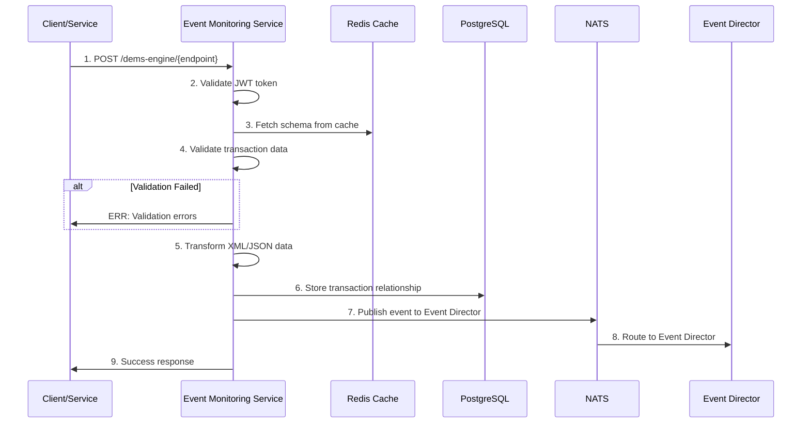

# Event Monitoring Service

<div align="center">

</div>

## Overview

High-performance middleware for the Tazama FRMS that receives, validates, and routes financial transaction requests to the Event Director.

**Key Capabilities:**

- Validates incoming transactions using JSON Schema
- Transforms XML/JSON transaction data
- Routes processed events via NATS messaging
- Persists transaction relationships in PostgreSQL
- Provides Redis caching for performance

### Setting Up

```sh
git clone https://github.com/tazama-lf/event-monitoring-service
cd event-monitoring-service
```

You then need to configure your environment: a [sample](.env.template) configuration file has been provided and you may adapt that to your environment. Copy it to `.env` and modify as needed:

```sh
cp .env.example .env
```

#### Prerequisites

- Node.js 20+
- PostgreSQL 15+
- Redis 7+
- NATS Server 2.10+

#### Build and Start

```sh
npm install
docker-compose up -d redis nats postgres
npm run start:dev
```

The service will be available at `http://localhost:3002`

#### Project Variables

| Variable    | Purpose                 | Example       |
| ----------- | ----------------------- | ------------- |
| `PORT`      | Port to serve on        | `3002`        |
| `NODE_ENV`  | Application environment | `development` |
| `LOG_LEVEL` | Logging verbosity       | `info`        |

#### Database Variables

| Variable            | Purpose           | Example     |
| ------------------- | ----------------- | ----------- |
| `DATABASE_HOST`     | PostgreSQL host   | `localhost` |
| `DATABASE_PORT`     | PostgreSQL port   | `5432`      |
| `DATABASE_NAME`     | Database name     | `tcs`       |
| `DATABASE_USER`     | Database user     | `postgres`  |
| `DATABASE_PASSWORD` | Database password | `postgres`  |

#### Cache Variables

| Variable         | Purpose                       | Example          |
| ---------------- | ----------------------------- | ---------------- |
| `REDIS_HOST`     | Redis host                    | `localhost`      |
| `REDIS_PORT`     | Redis port                    | `6379`           |
| `REDIS_PASSWORD` | Redis password                | `redis-password` |
| `CACHE_TTL`      | Cache time-to-live in seconds | `3600`           |

#### Messaging Variables

| Variable              | Purpose             | Example                 |
| --------------------- | ------------------- | ----------------------- |
| `NATS_URL`            | NATS server URL     | `nats://localhost:4222` |
| `NATS_CONSUMER_GROUP` | Consumer group name | `dems-consumer`         |

#### Authentication Variables

| Variable           | Purpose               | Example                 |
| ------------------ | --------------------- | ----------------------- |
| `JWT_SECRET`       | JWT signing secret    | `your-jwt-secret`       |
| `AUTH_SERVICE_URL` | Auth service endpoint | `http://localhost:3001` |

## API

### 1. Process Transaction

#### Description

Validates and processes financial transaction requests, then routes them to the Event Director.

#### Request

- **Method:** POST
- **URL:** `/dems-engine/{endpoint}`
- **Headers:**
  - `Authorization: Bearer <jwt-token>`
  - `Content-Type: application/json` or `application/xml`
- **URL Parameters:**
  - `endpoint`: Comma-separated endpoint identifier (e.g., "pacs,008,001,10")
- **Body:**

```json
{
  "transactionDetails": {
    "source": "bank-a",
    "destination": "bank-b",
    "TxTp": "transfer",
    "tenantId": "tenant-001",
    "MsgId": "msg-123456",
    "CreDtTm": "2024-01-01T00:00:00Z",
    "EndToEndId": "e2e-789"
  }
}
```

#### Response

- **Status Code:** 200 OK
- **Content-Type:** application/json
- **Body:**

```json
{
  "message": "Everything is OK!",
  "isMatch": true,
  "transactionRelationship": {
    "id": "uuid-12345",
    "source": "bank-a",
    "destination": "bank-b",
    "transactionType": "transfer"
  }
}
```

## Internal Process Flow

### Sequence Diagram



## Testing

Run the test suite to validate functionality:

```sh
npm run test
npm run test:cov
npm run test:e2e
```

For testing instructions, see `/docs/how to test dems.readme.md`

## Troubleshooting

### npm install

Ensure you have Node.js 20+ and proper network access to npm registry

### Database connection

Verify PostgreSQL is running and credentials are correct in `.env`

### Redis cache

Ensure Redis server is accessible and password is configured properly

### NATS messaging

Check NATS server connectivity and consumer group configuration
