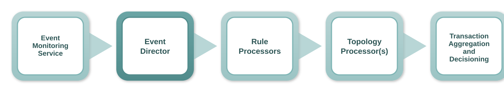
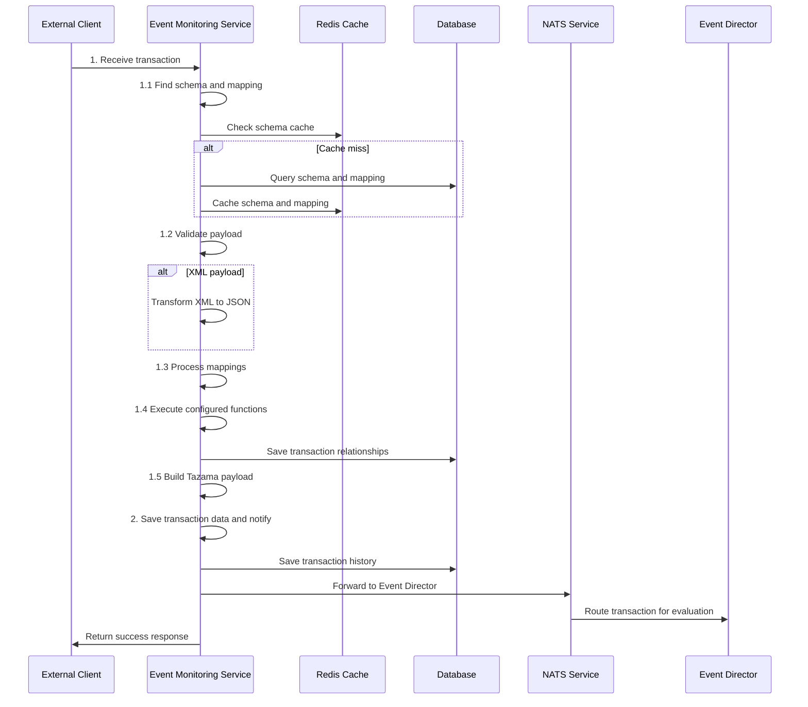

<!-- SPDX-License-Identifier: Apache-2.0 -->

- [The Event Monitoring Service](#the-event-monitoring-service)
  - [Event Monitoring Service Context](#event-monitoring-service-context)
    - [1. Receive Transaction](#1-receive-transaction)
      - [Payload:](#payload)
    - [1.1. Find Schema and Mapping](#11-find-schema-and-mapping)
    - [1.2. Validate Payload](#12-validate-payload)
    - [1.3. Process Mappings](#13-process-mappings)
    - [1.4. Execute Configured Functions](#14-execute-configured-functions)
    - [1.5. Build Tazama Payload](#15-build-tazama-payload)
    - [2. Save Transaction Data and Notify](#2-save-transaction-data-and-notify)
      - [Payload](#payload-1)

# The Event Monitoring Service



The Event Monitoring Service serves as the primary entry point for incoming transaction data in the Tazama Transaction Monitoring system. It is responsible for receiving, validating, transforming, and preparing transaction messages before forwarding them to the Event Director for evaluation. The service acts as a critical data ingestion and preparation layer that ensures all incoming transactions are properly formatted and enriched with necessary metadata.

The Event Monitoring Service handles multiple data formats (JSON and XML), performs schema validation, executes data transformations through configurable mappings, and maintains transaction history and relationships. It provides a robust foundation for the transaction monitoring pipeline by ensuring data quality and consistency before transactions enter the evaluation phase.

## Event Monitoring Service Context



### 1. Receive Transaction

The Event Monitoring Service accepts incoming transaction messages from external clients through RESTful API endpoints. The service supports multiple transaction types and data formats, providing a flexible interface for various payment systems and financial institutions to submit transaction data for monitoring.

#### Payload:

- Transaction data (original transaction message in JSON or XML format)
- Endpoint path (determines schema and mapping configuration)
- Tenant ID (extracted from authentication context)
- Content type (determines processing approach)

### 1.1. Find Schema and Mapping

The service retrieves the appropriate schema and mapping configuration for the incoming transaction based on the endpoint path. This configuration defines how the transaction should be validated, transformed, and processed.

The schema and mapping lookup process follows a caching strategy:

- First, the service checks Redis cache for the configuration
- If not found in cache, it queries the database for active configurations
- Retrieved configurations are cached for future requests to improve performance

The configuration includes:

- **Schema**: JSON Schema definition for payload validation
- **Mapping**: Data transformation rules for extracting and organizing transaction data
- **Functions**: Database operations and business logic to execute during processing

**Example Schema Configuration (sampleJson.json):**

```json
{
  "not": {
    "required": ["TenantId"]
  },
  "type": "object",
  "required": ["CstmrCdtTrfInitn"],
  "properties": {
    "CstmrCdtTrfInitn": {
      "type": "object",
      "required": ["GrpHdr", "PmtInf", "SplmtryData"],
      "properties": {
        "GrpHdr": {
          "type": "object",
          "required": ["MsgId", "CreDtTm", "NbOfTxs", "InitgPty"]
        },
        "PmtInf": {
          "type": "object",
          "required": ["PmtInfId", "PmtMtd", "ReqdAdvcTp", "ReqdExctnDt", "Dbtr", "DbtrAcct", "DbtrAgt", "CdtTrfTxInf"]
        },
        "SplmtryData": {
          "type": "object",
          "required": ["Envlp"]
        }
      }
    }
  },
  "additionalProperties": false
}
```

_Note: The above is a simplified excerpt. The full schema includes complete definitions for all nested properties including payment information, debtor/creditor details, amounts, and supplementary data fields. See the complete schema in `docs/helpers/sampleJson.json`._

### 1.2. Validate Payload

Using the retrieved schema configuration, the service validates the incoming payload structure to ensure data integrity and completeness. The validation process:

- Uses AJV (Another JSON Schema Validator) for robust schema validation
- Supports both JSON and XML payloads (XML is first transformed to JSON)
- Generates detailed error messages for validation failures
- Quarantines invalid transactions with detailed error information
- Ensures only properly structured data proceeds through the pipeline

For XML payloads, the service performs additional transformation steps:

- Parses XML using xml2js with schema-aware configuration
- Applies custom value processors to maintain data type integrity
- Converts XML structure to JSON while preserving required array fields

### 1.3. Process Mappings

The service executes configured data mappings to extract and organize transaction information into standardized formats. This process:

- Extracts data from various paths within the transaction payload
- Builds a data cache with key transaction attributes
- Creates transaction relationship records with standardized fields
- Supports complex mapping scenarios including:
  - Multiple source fields combined into single destinations
  - Value splitting and distribution across multiple fields
  - Constant value injection
  - Prefix/suffix application
  - Nested object construction

The mapping process populates two key data structures:

- **dataCache**: Key-value pairs for transaction attributes used in rule evaluation
- **transactionRelationship**: Standardized transaction details for monitoring and reporting

**Example Mapping Configuration (mapping.json):**

```json
[
  {
    "source": [
      "TenantId",
      "CstmrCdtTrfInitn.PmtInf.CdtTrfTxInf.Cdtr.Id.PrvtId.Othr.0.Id",
      "CstmrCdtTrfInitn.PmtInf.CdtTrfTxInf.Cdtr.Id.PrvtId.Othr.0.SchmeNm.Prtry"
    ],
    "delimiter": "",
    "destination": "redis.cdtrId",
    "transformation": "CONCAT"
  },
  {
    "source": [
      "TenantId",
      "CstmrCdtTrfInitn.PmtInf.Dbtr.Id.PrvtId.Othr.0.Id",
      "CstmrCdtTrfInitn.PmtInf.Dbtr.Id.PrvtId.Othr.0.SchmeNm.Prtry"
    ],
    "delimiter": "",
    "destination": "redis.dbtrId",
    "transformation": "CONCAT"
  },
  {
    "source": [
      "TenantId",
      "CstmrCdtTrfInitn.PmtInf.CdtTrfTxInf.CdtrAcct.Id.Othr.0.Id",
      "CstmrCdtTrfInitn.PmtInf.CdtTrfTxInf.CdtrAcct.Id.Othr.0.SchmeNm.Prtry",
      "CstmrCdtTrfInitn.PmtInf.CdtTrfTxInf.CdtrAgt.FinInstnId.ClrSysMmbId.MmbId"
    ],
    "delimiter": "",
    "destination": "redis.cdtrAcctId",
    "transformation": "CONCAT"
  },
  {
    "prefix": "",
    "source": [
      "TenantId",
      "CstmrCdtTrfInitn.PmtInf.DbtrAcct.Id.Othr.0.Id",
      "CstmrCdtTrfInitn.PmtInf.DbtrAcct.Id.Othr.0.SchmeNm.Prtry",
      "CstmrCdtTrfInitn.PmtInf.DbtrAgt.FinInstnId.ClrSysMmbId.MmbId"
    ],
    "delimiter": "",
    "destination": "transactionDetails.source",
    "transformation": "CONCAT"
  },
  {
    "source": ["CstmrCdtTrfInitn.PmtInf.CdtTrfTxInf.Amt.InstdAmt.Amt.Amt"],
    "destination": "transactionDetails.Amt",
    "transformation": "NONE"
  },
  {
    "source": ["CstmrCdtTrfInitn.GrpHdr.CreDtTm"],
    "destination": "transactionDetails.CreDtTm",
    "transformation": "NONE"
  },
  {
    "source": ["TenantId"],
    "destination": "transactionDetails.TenantId",
    "transformation": "NONE"
  }
]
```

_Note: The above is a simplified excerpt showing key mapping patterns. The full mapping configuration includes all fields for debtor/creditor identification, account details, amounts, timestamps, and geolocation data. See the complete mapping in `docs/helpers/mapping.json`._

### 1.4. Execute Configured Functions

Based on the configuration, the service executes predefined functions to perform additional data processing and storage operations. These functions may include:

- Saving transaction relationship data to the database
- Executing custom business logic functions
- Performing data enrichment operations
- Updating reference data or caches

The function execution is configurable and allows for extensible processing workflows tailored to specific deployment requirements.

**Example Functions Configuration (functions.json):**

```json
[
  {
    "params": ["redis.dbtrAcctId", "transactionDetails.TenantId"],
    "functionName": "addAccount"
  },
  {
    "params": ["redis.cdtrAcctId", "transactionDetails.TenantId"],
    "functionName": "addAccount"
  },
  {
    "params": ["redis.dbtrId", "transactionDetails.TenantId", "transactionDetails.CreDtTm"],
    "functionName": "addEntity"
  },
  {
    "params": ["redis.cdtrId", "transactionDetails.TenantId", "transactionDetails.CreDtTm"],
    "functionName": "addEntity"
  },
  {
    "params": ["redis.dbtrId", "redis.dbtrAcctId", "transactionDetails.CreDtTm", "transactionDetails.TenantId"],
    "functionName": "addAccountHolder"
  },
  {
    "params": ["redis.cdtrId", "redis.cdtrAcctId", "transactionDetails.CreDtTm", "transactionDetails.TenantId"],
    "functionName": "addAccountHolder"
  },
  {
    "params": [
      "transactionDetails.source",
      "transactionDetails.destination",
      "transactionDetails.TxTp",
      "transactionDetails.TenantId",
      "transactionDetails.MsgId",
      "transactionDetails.CreDtTm",
      "transactionDetails.EndToEndId"
    ],
    "functionName": "saveTransactionRelationship"
  }
]
```

The functions configuration demonstrates how the service systematically:

1. Registers debtor and creditor accounts (`addAccount`)
2. Records entity information for both parties (`addEntity`)
3. Links entities to their respective accounts (`addAccountHolder`)
4. Persists the complete transaction relationship record (`saveTransactionRelationship`)

Each function references parameters derived from either the Redis cache (`redis.*`) or transaction details (`transactionDetails.*`) populated during the mapping phase.

### 1.5. Build Tazama Payload

The service constructs a standardized Tazama payload that will be forwarded to the Event Director. This payload includes:

- **transaction**: The enhanced transaction data with tenant and transaction type information
- **TxTp**: Extracted transaction type for routing decisions
- **dataCache**: Processed transaction attributes for rule evaluation

### 2. Save Transaction Data and Notify

The final step involves persisting transaction data and forwarding the processed transaction to the Event Director for evaluation. This process executes in parallel:

- **Save Transaction History**: Stores the complete transaction payload for audit and replay purposes
- **Forward to Event Director**: Uses NATS messaging to send the transaction for rule-based evaluation

#### Payload

- Tazama payload (standardized transaction data with metadata)
- Transaction type (for Event Director routing)
- End-to-end ID (for transaction tracking)

The Event Monitoring Service forwards the prepared transaction to the Event Director using NATS (Neural Autonomic Transport System) messaging, enabling asynchronous and reliable message delivery for subsequent transaction evaluation and monitoring processes.
